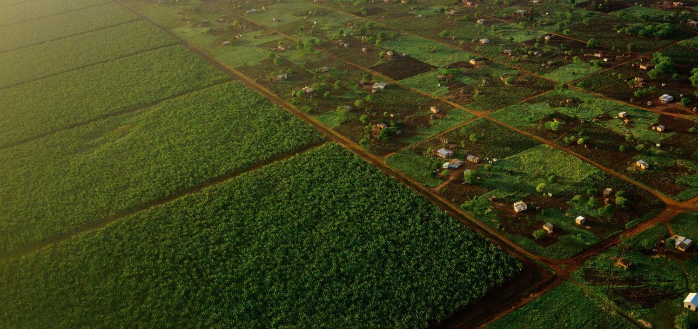

**Photo Credit:** Robin Hammond, [National Geographic](https://www.nationalgeographic.com/foodfeatures/land-grab/)

As a human-environment geographer, I study global environmental change and inequality by combining remote sensing, large social surveys, and statistical modeling. My research focuses on the social, climatic, and political drivers that generate inequality in multiple forms and how inequality in turn affects our environment. This research topic is grounded through two main areas of study. First land grabs that are redefining land control globally and where I study their influence on local land inequality, agricultural production, and well-being. Second, I use remote sensing to generate flood exposure maps globally that are subsequently combined with socio-demographic data to investigate inequities in exposure and recovery.

:rotating_light: **I am starting as a Assistant Professor at the University of Arizona in Fall 2023. I am actively recruiting graduate students. Please see the [Join the Team!](https://jonathanasullivan.github.io/jointheteam/) page for updates on opportunities and funding** :rotating_light:
