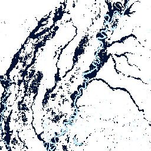
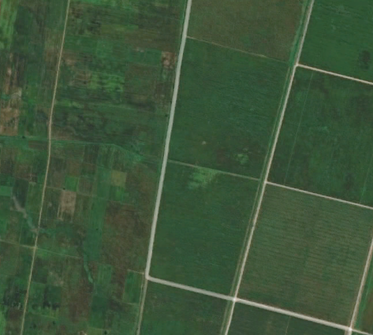
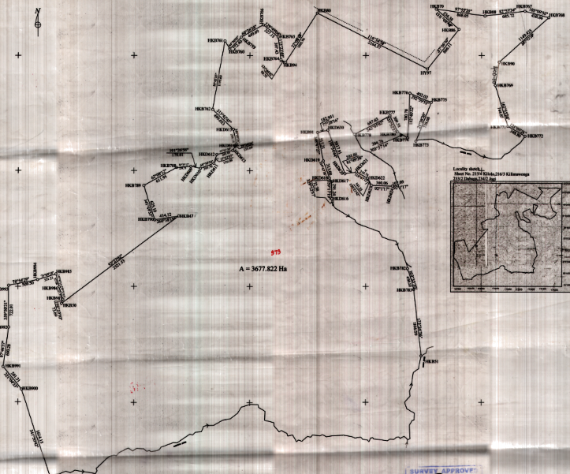

## Public Datasets

### [Global Flood Database](https://global-flood-database.cloudtostreet.ai/)
The Global Flood Database (GFD) combines over 15 years of flood data to create the first comprehensive satellite-based resource for global flood risk management and mitigation. With funding from Google Earth Outreach and collaboration with flood mapping experts at Cloud to Street and the DFO Flood Observatory, we combined 15+ years of flood data with human settlement data to create a comprehensive database for researchers, humanitarian workers, and community organizations. You can view or access the flood exposure data via the [GFD website](https://global-flood-database.cloudtostreet.ai/) or through the [Google Earth Engine](https://developers.google.com/earth-engine/datasets/catalog/GLOBAL_FLOOD_DB_MODIS_EVENTS_V1) catalog. For detail on the dataset, methods and findings see our [Nature paper](https://doi.org/10.1038/s41586-021-03695-w).

 
 

### Kilimo Kikubwa (*Big Ag* in Swahili)
A training dataset for deep learning segmentation of large-scale versus small-scale agriculture. Coming soon (hopefully 2023!)

 
 
 
 

## Lab Datasets
Our research team has developed a variety of different data products related to agriculture and flooding using satellite imagery and household surveys. We are very interested in collaborating with others to use these datasets to answer different questions related to food systems, flood expsoure or recovery or sustainable development more broadly. If you are interested in collaborating and using any of these datasets for your research, please send me an email with a short description of your research project.

 
 

### Household Surveys - Large-Scale Land Acquisitions (LSLAs)
We have collected >3,000 household surveys surrounding a set of 12 large-scale land acquisitions (LSLAs; also referred to as land grabs) in Tanzania and Ethiopia. The survey includes "control" households for the purposes of comparison to household nearby LSLAs and provides a statistical basis to understand the causal effects of LSLAs. Surveys were collected in 2018 and respondsents were asked about a number of livelihood conditions including demographics, income, labor, land-use, health, fuel use and direct effects of LSLAs. For an extract of our survey, see this [article](https://iopscience.iop.org/article/10.1088/1748-9326/ac8067).

 
 

### Property Boundaries - Large-Scale Land Acquisitions (LSLAs) in Tanzania
A set of ~100 Large-Scale Land Acquistions (LSLAs; also referred to as land grabs) were identifed in Tanzania through the land gazette which catalogues changes in land tenure from customary land to state land. Property maps for nearly all identified LSLAs were collected from the Ministry of Lands and digitized. This dataset enable land-use analysis within the boundaries of LSLAs in Tanzania occurring from 2000 and 2018 while also detailing the type of changes in land tenure. This dataset can also be aggregated at an administrative level with auxilliary data from social or agricultural census.  
