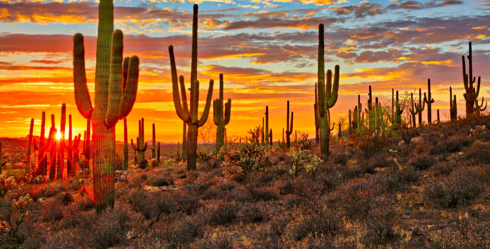

I am always looking to work with new people from undergraduates to graduate students who are interested in using a combination of remote sensing, household surveys, and statistical modeling to examine issues related to agriculture, flood risk and environmental change. I have current projects in Tanzania, Ethiopia, Zambia, and the United States, and I am open to students working in other regions. Please get in touch via email if you’re interested!

For specific opportunities coming up in the next year, see below. 

### Seeking PhD for Fall '23

I am recruiting candidates for a fully funded PhD study in human-environment geography to begin in Fall 2023. Candidates interested in quantitative and qualitative research on topics of agriculture, land tenure, food systems, food security, or flood exposure/ recovery - particularly with a focus in low- and middle-income countries - are especially welcome to apply. A Bachelor’s or Master’s degree or significant coursework in natural or environmental social sciences is preferable, but not required, as is relevant research and/or professional experience.

Two-years of funding are provided as a Graduate Research Assistant (GRA) with the remainder of funding provided in the form of Teaching Assistantships. Though, additional funding for a Graduate Research Assistant (GRA) may arise soon and I also emphasize helping my students to raise funding through internal and external opportunities so to fund YOUR big ideas!

The funded Graduate Research Assistant (GRA) will work with me on one of two themes: i) agricultural change in the context of changing land tenure because of land grabs OR ii) the socio-economic and health impacts of flood exposure in the United States. Both research themes emphasize the use of large spatio-temporal datasets and statistical modeling/ machine learning, including the application of deep learning to satellite imagery. Not all expertise enlisted above can be met fully and therefore I seek candidates with experience in one or more of the following:

- M.Sc. or 2+ years of professional experience in remote sensing analysis
- Experience in working with spatial and/or temporal databases
- Strong statistical skills, and demonstrated experience with statistical programming languages (e.g. R) and methods 
- Experience with geographical data and analyses (using GIS software)
- Coursework or professional experience in natural resource management, climate policy, or flood mitigation
- Experience in working within an interdisciplinary context, including the handling and understanding of both ecological and socioeconomic concepts and data
- Capacity to work and think independently, develop and implement own ideas, and persistence in completing tasks.
- High proficiency in English (both written and verbal) and experience with scientific writing.

For interested candidates, send me an email with your research interests and a CV. For details on the application, visit the School of Geography, Development and Environment (SGDE) [website](https://geography.arizona.edu/maphd-program/apply) (deadline January 5th).

### Postdoc 
I currently do not have any opportunities for postdocs at this time.
