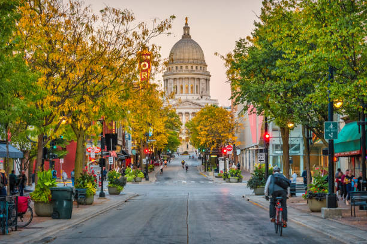

I am always looking to work with new people from undergraduates to graduate students who are interested in using a combination of remote sensing, household surveys, and statistical modeling to examine issues related to agriculture, flood risk and environmental change. I have current projects in Tanzania, Ethiopia, Zambia, and the United States, and I am open to students working in other regions. Please get in touch via email if you’re interested!

<!---
For specific opportunities coming up in the next year, see below. 

## :rotating_light: Seeking PhD Candidate for Fall '24 :rotating_light:
The University of Arizona SGDE program accepts PhD applications on an annual basis on Jan 5th. You can learn more about the MA/PhD program at SGDE [here](https://geography.arizona.edu/maphd-program/apply). Interested PhD students should email me with a paragraph of their research interests and a CV. 

## Postdoc 
I currently do not have any funded opportunities for postdocs at this time. However, I'm always eager to hear from exceptional scholars eager to join the lab as postdocs or scientists. I encourage potential postdocs to contact me to discuss internal and external funding opportunities including the [University of Arizona's President's Postdoctoral Fellowship](https://presidentspostdoc.arizona.edu/), [US Fulbright Programs (for EU citizens)](https://www.fulbrightschuman.eu/grants-eu-citizens/post-doctoral-research/), or [NSF's SBE Postdoctoral Fellowship](https://beta.nsf.gov/funding/opportunities/sbe-postdoctoral-research-fellowships-sprf).
-->